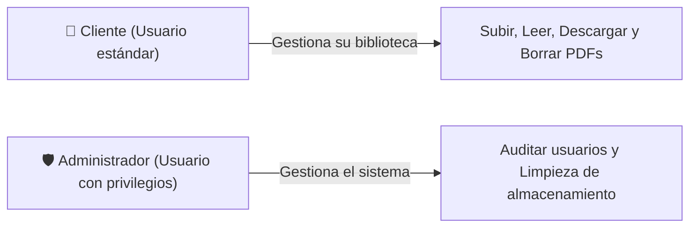
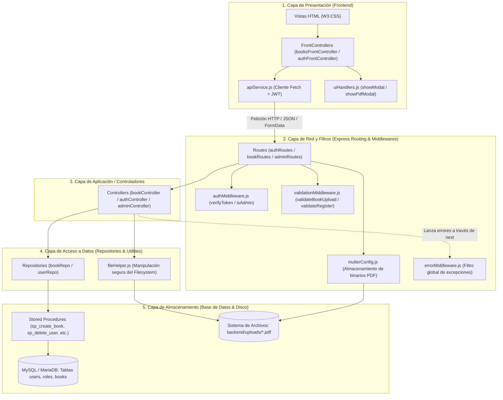
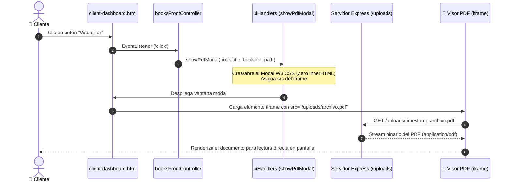
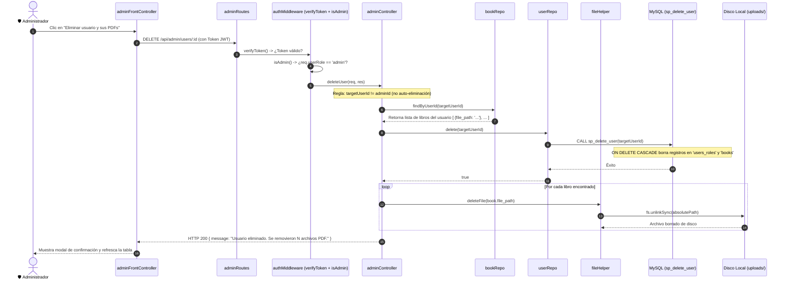

# 📘 Casos de Uso, Arquitectura y Relaciones entre Componentes - Bibliotech

Este documento describe en profundidad los **Casos de Uso**, el flujo de comunicación entre clases/módulos y la dinámica de **"quién le pide qué a quién"** a través de las N capas del sistema **Bibliotech**.

---

## 1. Actores del Sistema

* **Cliente**: Usuario registrado que dispone de una biblioteca privada donde puede subir sus documentos PDF, leerlos en el visor integrado, descargarlos a su equipo o borrarlos.
* **Administrador**: Usuario responsable del mantenimiento del sistema. Tiene visibilidad global de todos los usuarios registrados y la facultad de dar de baja cuentas, lo cual desencadena la remoción física de los archivos asociados.

---

## 2. Catálogo de Casos de Uso

| ID | Caso de Uso | Actor | Descripción |
| :--- | :--- | :--- | :--- |
| **CU01** | **Registrar Cliente** | Invitado / Cliente | Permite crear una nueva cuenta con rol `client`. Valida longitud de contraseña (mínimo 6 caracteres) y unicidad de username. |
| **CU02** | **Iniciar Sesión** | Cliente / Administrador | Valida credenciales contra hash Bcrypt y genera un JSON Web Token (JWT) con el ID y rol correspondiente. |
| **CU03** | **Cargar Documento PDF** | Cliente | Sube un archivo binario `.pdf` junto a sus metadatos (Título, Autor, Categoría, Páginas). Realiza validación de tipo MIME y tamaño. |
| **CU04** | **Visualizar Documento en el Sitio** | Cliente | Abre el documento PDF en un visor modal integrado (`iframe`) para lectura cómoda sin salir de la plataforma. |
| **CU05** | **Descargar Documento** | Cliente | Permite descargar el archivo binario del PDF al disco local del dispositivo. |
| **CU06** | **Eliminar Documento** | Cliente | Elimina el registro del libro en la base de datos (verificando autoría) y remueve el archivo físico de la carpeta `uploads/`. |
| **CU07** | **Listar Usuarios** | Administrador | Devuelve la lista completa de usuarios registrados, roles y fechas de alta. |
| **CU08** | **Eliminar Usuario y Limpieza** | Administrador | Elimina un usuario, sus registros en cascada en la BD y borra físicamente todos sus archivos PDF del disco. Impide la auto-eliminación. |

---

## 3. Arquitectura en N Capas: ¿Quién le pide qué a quién?

La arquitectura está construida para que **cada capa solo hable con su capa inmediata inferior**, evitando acoplamientos y facilitando pruebas independientes.

---

## 4. Desglose Detallado de Interacciones por Flujo

### 🔁 Flujo A: Carga de un Libro PDF (CU03)

1. **Usuario e Interfaz (`client-dashboard.html`)**:
   * El cliente completa el formulario y presiona *"Cargar a la biblioteca"*.
2. **`booksFrontController.js`**:
   * Captura el evento `submit`, empaqueta los datos y el archivo binario en un objeto `FormData`.
   * **Le pide a `apiService`**: Enviar los datos por `POST /api/books/upload`.
3. **`apiService.js`**:
   * Recupera el JWT guardado en `localStorage` a través de `authHelper.getToken()`.
   * Adjunta la cabecera `Authorization: Bearer <token>` y realiza el `fetch`.
4. **`bookRoutes.js`**:
   * Recibe la petición y define el pipeline de ejecución en orden:
     1. `authMiddleware.verifyToken`
     2. `uploadMiddleware` (`multerConfig.js`)
     3. `validationMiddleware.validateBookUpload`
     4. `bookController.uploadBook`
5. **`authMiddleware.verifyToken`**:
   * **Le pide a `jsonwebtoken`**: Verificar la firma del token con `SECRET_KEY`.
   * Si es válido, inyecta `req.userId` y `req.userRole` en la request y llama a `next()`.
6. **`multerConfig.js`**:
   * Inspecciona el tipo MIME (`application/pdf`).
   * Guarda temporalmente el archivo en disco (`backend/uploads/timestamp-archivo.pdf`).
   * Deja la referencia del archivo en `req.file` y llama a `next()`.
7. **`validationMiddleware.validateBookUpload`**:
   * Verifica que `title`, `author`, `category` y `pages` existan y tengan formatos válidos.
   * *Si la validación falla*: **Le pide a `fileHelper`** borrar el archivo físico que Multer acababa de escribir (para no dejar basura en disco) y retorna HTTP 400.
   * *Si pasa*: Llama a `next()`.
8. **`bookController.uploadBook`**:
   * Extrae los datos validados y la ruta generada `/uploads/...`.
   * **Le pide a `bookRepo.create`**: Persistir el nuevo libro con el `userId`.
9. **`bookRepo.js`**:
   * **Le pide a la Base de Datos**: Ejecutar la consulta SQL `CALL sp_create_book(?, ?, ?, ?, ?, ?, ?)`.
   * Retorna el `insertId` generado al controlador.
10. **Respuesta final**:
    * El controlador responde con HTTP 201 `{ message: "...", id: insertId, path: filePath }`.
    * `booksFrontController` recibe la confirmación, llama a `showModal('Éxito', ...)` y refresca la tabla llamando a `loadBooks()`.

---

### 📖 Flujo B: Lectura y Descarga en el Sitio (CU04 & CU05)

* **Para la Lectura**: La vista delega a `showPdfModal`, que levanta un modal con un `<iframe>` apuntando a la ruta servida de forma estática por Express (`express.static`). El cliente lee el contenido aprovechando el motor de renderizado PDF del navegador.
* **Para la Descarga**: `booksFrontController` genera dinámicamente un tag `<a>` con el atributo HTML5 `download="${b.title}.pdf"` apuntando a `b.file_path`. Al hacer clic, el navegador descarga el archivo directamente sin recargar la página.

---

### 🛡️ Flujo C: Auditoría y Borrado Administrativo Recursivo (CU08)

Este flujo garantiza la **integridad referencial** y la **sostenibilidad del almacenamiento** (Green Software Engineering), evitando que queden archivos huérfanos en disco cuando se borra una cuenta.

---

## 5. Matriz de Clases / Módulos y Contratos de Comunicación

| Módulo / Clase | Responsabilidad Principal | ¿A quién le solicita servicios? | ¿Qué información le entrega / recibe? |
| :--- | :--- | :--- | :--- |
| **`authFrontController`** | Manejar eventos del DOM en login y registro. | `apiService`, `authHelper`, `uiHandlers`. | Entrega credenciales; recibe token/rol; solicita abrir modales informativos. |
| **`booksFrontController`** | Renderizar catálogo de libros y formulario de subida. | `apiService`, `uiHandlers`. | Entrega FormData con archivo; recibe lista JSON de libros; solicita abrir visor modal. |
| **`adminFrontController`** | Renderizar tabla de usuarios y coordinar bajas. | `apiService`, `uiHandlers`. | Solicita `GET /api/admin/users` y `DELETE /api/admin/users/:id`. |
| **`apiService`** | Cliente HTTP centralizado. | `authHelper`, API REST Backend (`fetch`). | Agrega cabeceras `Authorization: Bearer <token>`; parsea respuestas JSON; maneja 401 automático. |
| **`uiHandlers`** | Generación dinámica de componentes modales seguros (Zero innerHTML). | DOM del navegador. | Crea y administra los nodos `#msgModal` y `#pdfModal` (`<iframe>`). |
| **`authMiddleware`** | Guardián de seguridad y control de acceso RBAC. | `jsonwebtoken`. | Decodifica token; adjunta `req.userId` y `req.userRole`; rechaza con 401/403 si no tiene privilegios. |
| **`validationMiddleware`** | Filtro de integridad de datos de entrada. | `fileHelper`. | Valida longitud de contraseñas, existencia de campos y formato PDF; borra archivos en disco si falla la validación. |
| **`errorMiddleware`** | Filtro global de excepciones. | Express (`err, req, res, next`). | Traduce códigos técnicos de MySQL (`ER_DUP_ENTRY` -> HTTP 409, `ECONNREFUSED` -> HTTP 500) a respuestas amigables. |
| **`authController`** | Lógica de sesión y registro. | `bcrypt`, `userRepo`, `jsonwebtoken`. | Encripta contraseñas; invoca creación en DB; firma tokens de autenticación. |
| **`bookController`** | Gestión documental de libros. | `bookRepo`, `fileHelper`. | Solicita persistencia de metadatos de PDFs; solicita borrado en disco y DB ante errores. |
| **`adminController`** | Lógica de mantenimiento y limpieza global. | `userRepo`, `bookRepo`, `fileHelper`. | Consulta documentos de un usuario antes de darlo de baja; coordina borrado en base de datos y borrado físico de archivos. |
| **`userRepo`** | Abstracción de acceso a datos de Usuarios (Repository Pattern). | `config/db.js` (Pool MySQL). | Ejecuta `CALL sp_create_user`, `sp_find_user_by_username`, `sp_find_all_users`, `sp_delete_user`. |
| **`bookRepo`** | Abstracción de acceso a datos de Libros (Repository Pattern). | `config/db.js` (Pool MySQL). | Ejecuta `CALL sp_create_book`, `sp_find_books_by_user`, `sp_find_book_by_id`, `sp_delete_book`. |
| **`fileHelper`** | Gestión atómica del sistema de archivos. | Módulo nativo `fs` y `path` de Node.js. | Normaliza rutas relativas a absolutas y ejecuta `fs.unlinkSync()` protegiendo contra excepciones. |
